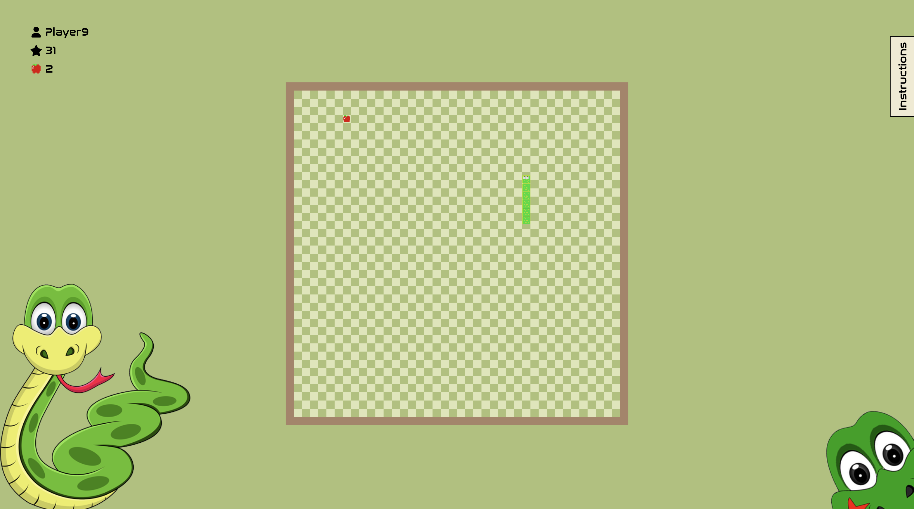
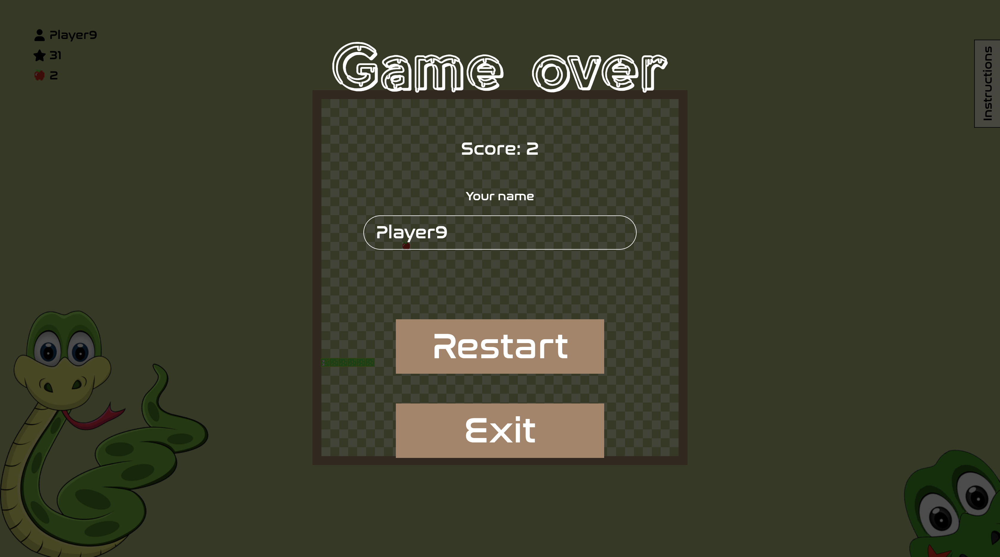
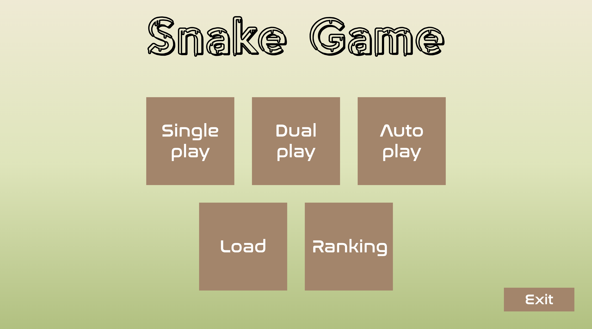
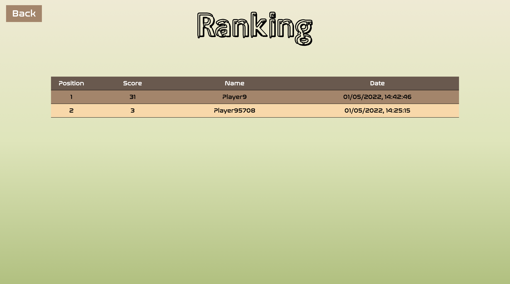

# OSS snake assignment

Simple version of the snake game.



## 📝 How to launch

First, yarn must be installed in your system. To install it, you must use the package manager npm. For more information, please visit https://docs.npmjs.com/downloading-and-installing-node-js-and-npm

Once npm is installed, you can run the following command to install yarn.

```bash
npm install -g yarn
```

If yarn is not working after running this command, try to close your terminal or reopen it. Or visit https://classic.yarnpkg.com/lang/en/docs/install

Then, to run the project, you must be at the root of the repository and run these following commands.

```bash
yarn install # Install dependencies
yarn parcel src/index.html # For development
yarn parcel build src/index.html # For production
```

## 📜 Rules

To develop this game, we followed the classic rules of the snake game :
- The size of the board is 40 x 40 or larger.
- The snake starts at the center of the board, moving north (upward).
- The snake moves at a constant speed.
- The snake moves only north, south, east, or west.
- An apple appears at a random location (but the location where the snake can reach).
  - There is always exactly one apple visible at any given time.
- When the snake "eats" (runs into) an apple, it gets longer.
- The game continues until the snake "dies".
  - The snake dies by either (1) running into the edge of the board, or (2) by running into
    its own body.
- Once the snake dies, the final score is calculated based on the number of apples eaten by
  the snake.

## ⭐️ Features

Here is the list of features implemented in the game :
- Save and load the game
- Ranking score
- Highest score
- Classic snake game
- Pause the game
- Change username

## 🧑‍💻 Coding convention

The project has been coded in HTML, SCSS and Typescript.

For HTML, we use the following coding convention -> https://www.w3schools.com/html/html5_syntax.asp

For SCSS, we use this one -> https://docs.gitlab.com/ee/development/fe_guide/style/scss.html

For typescript, here is the list of coding style rules :

| Rules       | Description                                         |
|-------------|-----------------------------------------------------|
| Filename    | PascalCase if this is a class, otherwise kebab-case |
| Directory   | kebab-case                                          |
| Class name  | PascalCase                                          |
| Variable    | camelCase                                           |
| Indentation | 4 spaces, don't use tab                             |

## 👨‍💼 Authors

This project has been made by a group of three students at Chung Ang University :
- Amaury Lecomte
- Lucas Baykan
- Valentin de Saint Jacob

For any question, please free to contact us :)

## 📄 License

This project is licensed under the terms of the MIT license.

## 📕 Documentation

We use parcel to build the application. For more information -> https://parceljs.org/

## 📸 Screenshots





